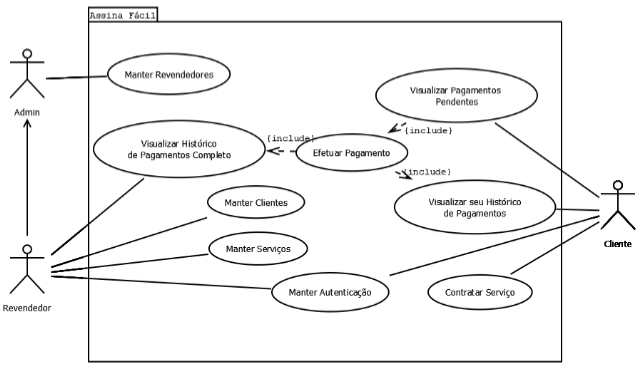
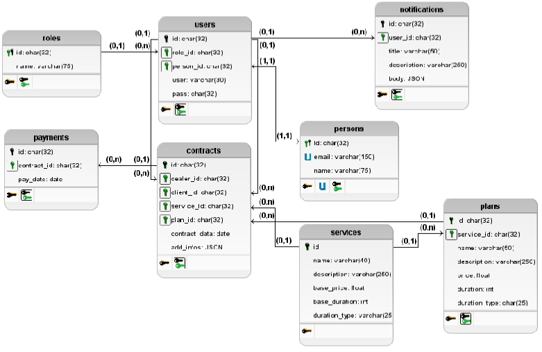

# Assina Fácil

## 1. Visão Geral do Projeto

### 1.1 Contextualização

No contexto da comercialização de sistemas e serviços digitais sob demanda ou por assinatura — como manutenção de sites, suporte técnico remoto, hospedagens ou SaaS — o **Assina Fácil** também se destaca como uma solução viável e estratégica. Pequenas e médias empresas que atuam na revenda ou no desenvolvimento de software frequentemente precisam gerenciar diversos contratos e cobranças mensais, o que, se feito de forma manual, aumenta o risco de erros e inadimplência.

Com o **Assina Fácil**, esses negócios passam a contar com uma plataforma centralizada que automatiza a gestão de clientes, pagamentos e serviços, promovendo escalabilidade e profissionalismo. Isso permite que o foco do gestor esteja no crescimento da carteira de clientes e na melhoria do serviço, e não nas tarefas burocráticas do dia a dia.

### 1.2 Descrição do Produto do Projeto

O **Assina Fácil** é uma plataforma web que tem como objetivo oferecer uma solução completa para empresas que prestam serviços mensais. O sistema é voltado à administração eficiente de clientes e finanças, com foco na organização e automação de cobranças recorrentes.

O sistema será composto por dois ambientes principais:

- **Painel Administrativo**: Interface exclusiva para o gestor do sistema.
- **Painel do Cliente**: Área exclusiva para os clientes finais, com acesso feito por login e senha individual.

### 1.3 Funcionalidades

- **RF01**: O sistema deve permitir que todos os usuários (Clientes, Revendedores e Administradores) realizem login com credenciais específicas.
- **RF02**: O sistema deve permitir que os usuários façam logout de forma segura.
- **RF03**: O sistema deve permitir que o Revendedor cadastre novos clientes.
- **RF04**: O sistema deve permitir que o Revendedor edite os dados dos seus clientes.
- **RF05**: O sistema deve permitir que o Revendedor exclua clientes.
- **RF06**: O sistema deve restringir o acesso de clientes apenas aos que estiverem cadastrados por um Revendedor.
- **RF07**: O sistema deve permitir que o Revendedor cadastre novos serviços.
- **RF08**: O sistema deve permitir que o Revendedor edite os serviços existentes.
- **RF09**: O sistema deve permitir que o Revendedor exclua serviços.
- **RF10**: O sistema deve permitir que o Cliente visualize a lista de serviços disponíveis para contratação.
- **RF11**: O sistema deve permitir que o Cliente contrate novos serviços por meio da plataforma.
- **RF12**: O sistema deve permitir que o Cliente visualize seus pagamentos pendentes.
- **RF13**: O sistema deve permitir que o Cliente realize pagamentos via Pix diretamente pela plataforma.
- **RF14**: O sistema deve permitir que o Cliente visualize seu histórico completo de pagamentos.
- **RF15**: O sistema deve permitir que o Cliente cancele o contrato de algum serviço.
- **RF16**: O sistema deve permitir que o Revendedor visualize o histórico completo de todos os pagamentos realizados por seus clientes.
- **RF17**: O sistema deve permitir que o Revendedor visualize uma lista de clientes com pagamentos pendentes.
- **RF18**: O sistema deve permitir que o Administrador cadastre, edite e exclua Revendedores.
- **RF19**: O sistema deve garantir que apenas o Administrador tenha acesso às funções de gerenciamento de Revendedores.
- **RF20**: O sistema deve notificar o Revendedor sempre que algum cliente efetuar algum pagamento.
- **RF21**: O sistema deve notificar o Cliente quando o prazo de pagamento estiver acabando.

---

## 2. Diagrama de Casos de Uso

---

## 3. Diagrama Físico de Banco de Dados

---

> Projeto desenvolvido para automatizar e simplificar a gestão de serviços recorrentes em empresas de tecnologia.

## 4. Lista de Comandos Para Executar o sistema

- npm install
- composer install
- cp .env.example .env
- php artisan key:generate
- php artisan migrate
- php artisan db:seed (opcional)
- npm run dev
- php artisan serve